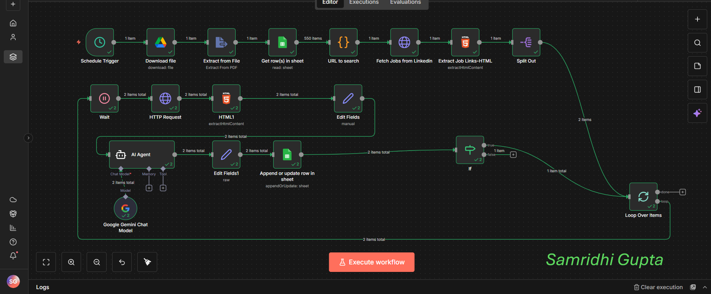

# LinkedIn Job Scraper Automation

An automated n8n workflow that scrapes LinkedIn job postings, analyzes job matches using AI, and generates personalized cover letters based on your resume.

## Overview

This workflow automatically searches LinkedIn for jobs based on configurable criteria, extracts job details, calculates job matching scores using AI analysis, generates cover letters, and stores everything in a Google Sheets spreadsheet for easy management.

## Features

- **Automated Scheduling**: Runs twice daily (8 AM and 3 PM)
- **Resume Integration**: Downloads and processes your resume from Google Drive
- **Intelligent Job Matching**: Uses AI to calculate compatibility scores between your resume and job descriptions
- **Cover Letter Generation**: Creates personalized cover letters for each job posting
- **LinkedIn Job Scraping**: Extracts job details including title, company, location, and description
- **Google Sheets Integration**: Stores all job data in an organized spreadsheet
- **Customizable Search Parameters**: Configure keywords, location, experience level, remote work options, job type, and easy apply filter

## Workflow Components

### 1. Schedule Trigger
- Executes workflow automatically at 8 AM and 3 PM daily
- Ensures regular job discovery without manual intervention

### 2. Resume Management
- Downloads resume PDF from Google Drive
- Extracts text content for AI analysis

### 3. Job Search Configuration
Reads search parameters from Google Sheets including:
- **Keywords**: Job titles or skills to search for
- **Location**: Geographic location for job search
- **Experience Level**: Internship, Entry level, Associate, Mid-Senior level, Director, Manager
- **Remote Options**: Remote, Hybrid, In-Office, US Remote
- **Job Type**: Full-time, Part-time, Contract, etc.
- **Easy Apply**: Filter for LinkedIn Easy Apply jobs

### 4. Dynamic URL Generation
JavaScript code transforms search parameters into LinkedIn job search URLs with proper encoding:
- Experience levels mapped to LinkedIn codes (1-6)
- Remote work options mapped to LinkedIn codes (1-4)
- Job types converted to LinkedIn format

### 5. Job Data Extraction
- Fetches LinkedIn job listings via HTTP requests
- Extracts job links from search results
- Scrapes individual job pages for detailed information:
  - Job title
  - Company name
  - Location
  - Full job description
  - Job ID and application link

### 6. AI-Powered Analysis
Uses Google Gemini AI to:
- Compare resume content with job descriptions
- Calculate compatibility scores (0-100)
- Generate personalized cover letters (minimum 2 paragraphs)
- Ensure proper JSON formatting for data parsing

### 7. Data Storage
Stores extracted data in Google Sheets with columns:
- Link (job application URL)
- Title
- Company
- Location
- Description
- Score (AI-calculated match score)
- Cover Letter (AI-generated personalized letter)

### 8. Rate Limiting
- 2-second delays between job page requests
- Batch processing to prevent overwhelming LinkedIn servers
- Loop structure for processing multiple jobs sequentially

## Prerequisites

### Required Credentials
1. **Google Drive OAuth2**: For resume file access
2. **Google Sheets OAuth2**: For configuration and data storage
3. **Google Gemini API**: For AI analysis and cover letter generation

### Required Google Drive/Sheets Setup
1. **Resume PDF**: Upload to Google Drive
2. **Job Search Configuration Sheet**: Create with columns for search parameters
3. **Results Storage Sheet**: Create with columns for job data

## Configuration

### Google Sheets Setup
Create a configuration sheet with these fields:
- Keyword
- Location
- Experience Level
- Remote
- Job Type
- Easy Apply

### File IDs to Update
- Resume file ID: `YOUR_RESUME_FILE_ID`
- Configuration sheet ID: `YOUR_CONFIG_SHEET_ID`
- Results sheet ID: `YOUR_RESULTS_SHEET_ID`

## Technical Details

### Experience Level Mapping
- Internship → 1
- Entry level → 2
- Associate → 3
- Mid-Senior level → 4
- Director → 5
- Manager → 6

### Remote Work Mapping
- In-Office → 1
- Remote → 2
- Hybrid → 3
- US Remote → 4

### Job Type Mapping
Converts job types to LinkedIn single-character codes (F, P, C, etc.)

## Technical Features

- AI-powered job matching and cover letter generation
- JSON parsing with error handling
- Rate limiting to prevent API throttling
- Batch processing for multiple job listings
- Conditional logic for search parameters

## Setup

1. Import the n8n workflow JSON file
2. Set up Google Drive and Sheets credentials in n8n
3. Update file IDs in workflow nodes with your Google Drive/Sheets IDs
4. Configure job search parameters in your Google Sheet
5. Upload resume to Google Drive
6. Activate the workflow

## Output

The workflow generates a comprehensive job database with:
- Complete job details from LinkedIn
- AI-calculated compatibility scores
- Personalized cover letters for each position
- Direct application links
- Organized data structure for easy review and follow-up
